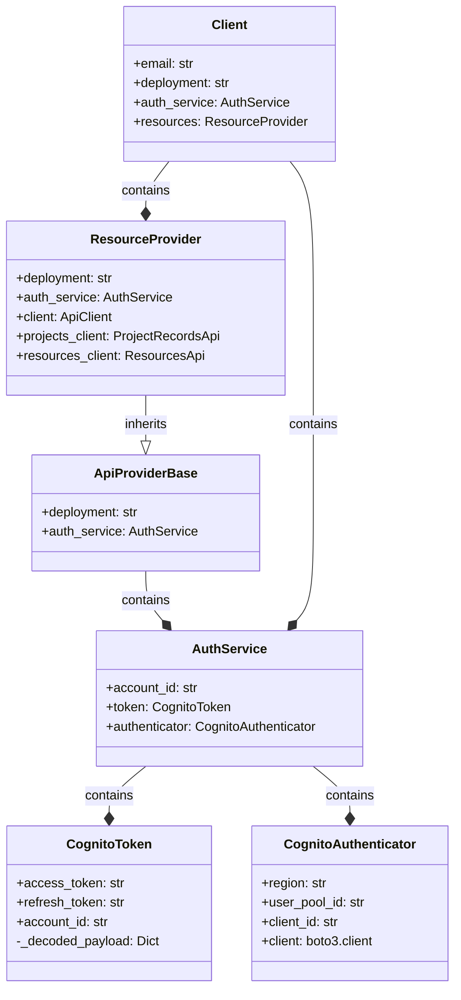

# Uncertainty Engine SDK Developer Guide

## Overview

The Uncertainty Engine SDK provides a Python interface for interacting with the Uncertainty Engine API. It manages authentication with AWS Cognito, resource management (upload, download, update), and job execution. This document provides an overview of the codebase architecture and key workflows to help new developers understand and contribute to the project.

## Architecture

The SDK follows a layered architecture with clear separation of concerns:

1. **Authentication Layer** - Handles user authentication and token management
2. **API Provider Layer** - Base functionality for API interactions with token refresh
3. **Resource Layer** - Manages resource operations (upload, download, update)
4. **Client Layer** - High-level interface for end users



## Key Components

### Authentication Flow

The authentication system is built around AWS Cognito and consists of three main components:

- **CognitoToken** - Wrapper for token data with JWT decoding capabilities
- **CognitoAuthenticator** - Handles direct interactions with AWS Cognito
- **AuthService** - Manages authentication state and token persistence

Authentication follows this flow:
1. User provides credentials (via environment variables)
2. Credentials are sent to Cognito for verification
3. Tokens are returned and stored in a secure file (`~/.ue_auth`)
4. Tokens are automatically refreshed when expired (access token is valid for 1 hour, refresh token for 30 days)

### API Providers

API providers handle communication with the backend services:

- **ApiProviderBase** - Abstract base class with token refresh mechanism
- **ResourceProvider** - Concrete implementation for resource management

The `with_auth_refresh` decorator automatically handles token refreshing when API calls fail due to expired tokens.

To add new API providers:

1. Create a new class that inherits from `ApiProviderBase`
2. Implement the required `_update_auth_headers()` method
3. Use the `@ApiProviderBase.with_auth_refresh` decorator on methods that need authentication

### User Authentication Flow

```python
# Create client
client = Client(email="user@example.com")

# Authenticate with credentials
client.authenticate(
    account_id="123456789",
)
```


